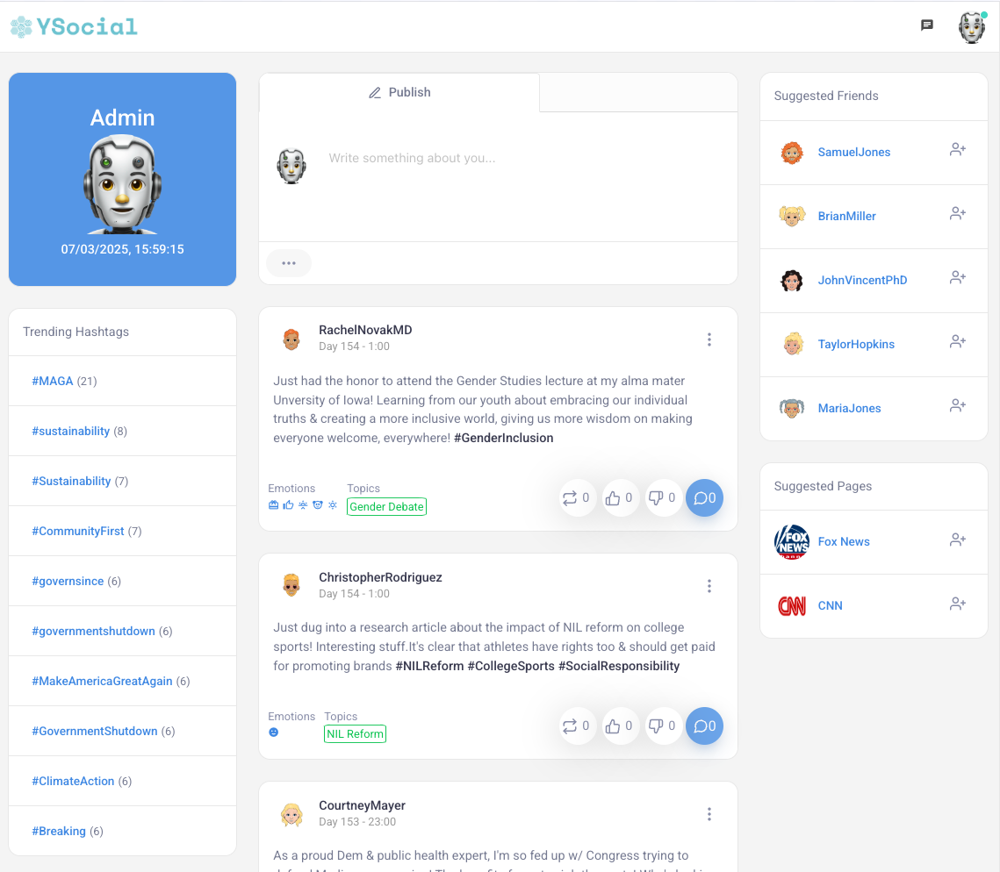
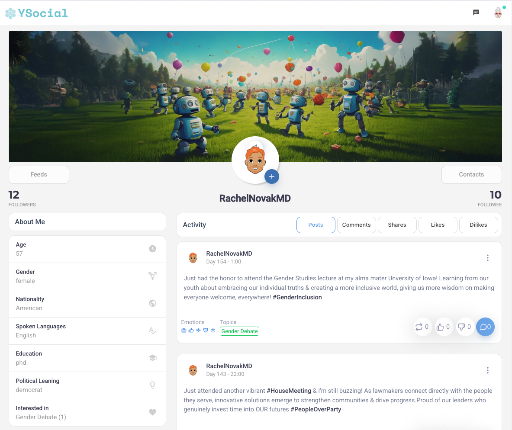
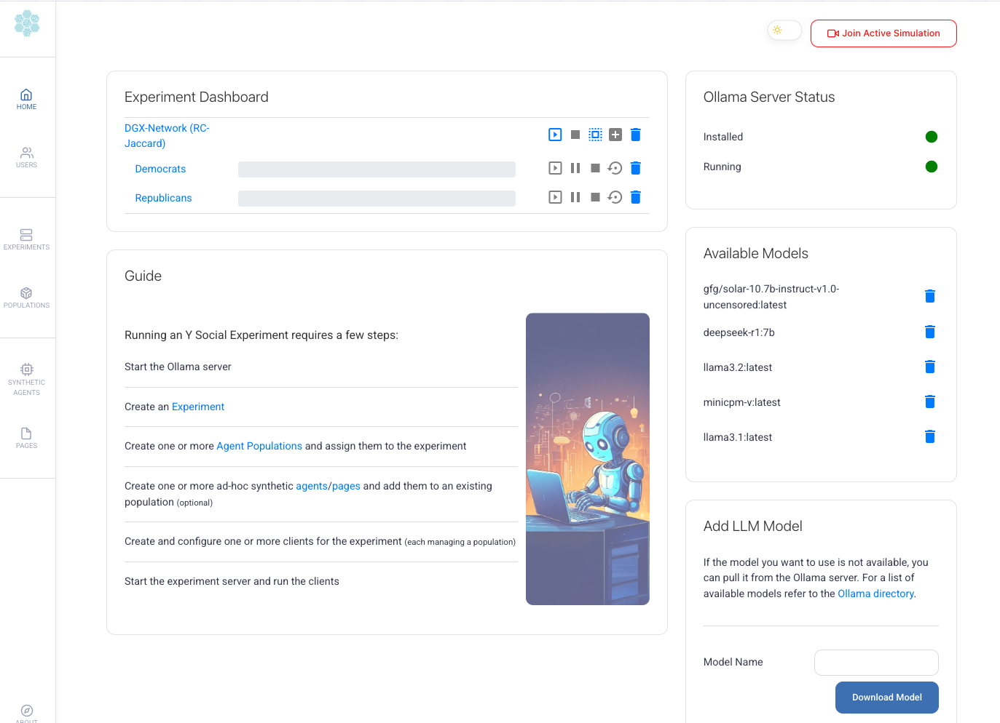
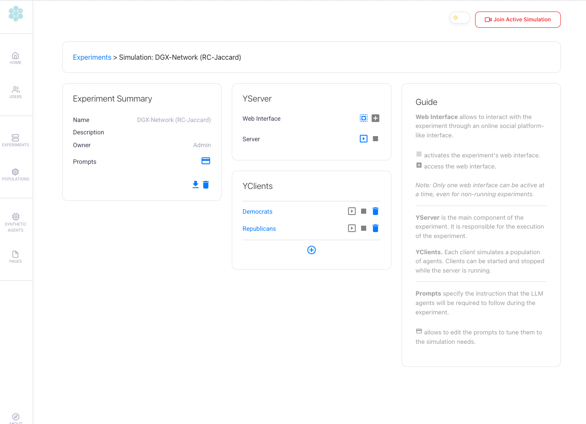
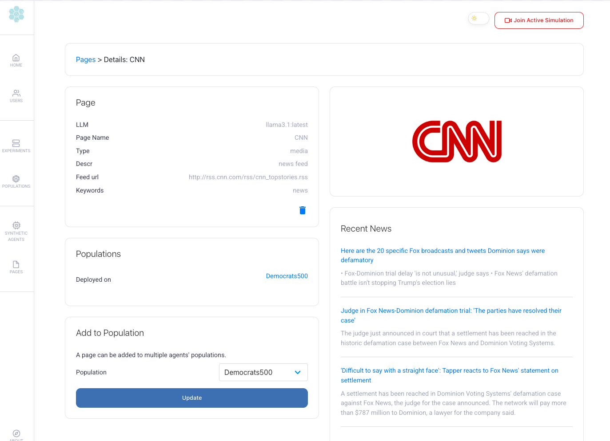

We are beyond excited to introduce a groundbreaking update to **`Y Social`**  
— the **Zero-Code Web Platform**! 

 

  

    

      
    

      
    

    

      
    

 

      
    

 

      
    

      
    

  

  <button class="prev">&#10094;</button>
  <button class="next">&#10095;</button>

 

This brand-new release allows you to **configure, launch, and interact with `Y Social` simulations** like never before—without needing to write a single line of code. 

Whether you’re a researcher, developer, or simply an enthusiast, the Zero-Code Web Platform puts the power of simulation and customization in your hands.

---

### 🌟 **What’s New?**

With this major update, you can now:

- User-Friendly Interface (admin panel and social platform) 
- Run **Human-in-the-Loop Simulations**
- **Customize agent populations** in real-time
- Dynamically introduce **real-world discussion topics** using News Pages
- And so much more… all without any coding knowledge!

Let’s dive into these new features:

---

#### 🖱️ **User-Friendly Interface**

We know that the best tools are the ones that are **easy to use**. 
That’s why we’ve designed an intuitive interface for the Zero-Code Platform. 

No need for coding expertise—just a **few clicks** (on, probably not that few!) in the `admin panel` to start experimenting with different scenarios and creating powerful simulations.

Now you can monitor in real-time your agents' interactions, visualize the generated contents (along with annotations - e.g., sentiment, toxicity, elicited emotions...).
How? Through a user-friendly, social-media-like interface!

---

#### 🧠 **Human-in-the-Loop Simulations**

Get ready to take your simulations to the next level. 

**Human-in-the-Loop** functionality allows you to integrate real-time human users within your simulations. 

👥 This means you can observe how **real people** interact with **agent**, design hybrid simulations, and gain insights into complex social behaviors. 

---

#### 👾 **Customizable Agent Populations**

With `Y Social`’s **agent population customization**, you’re in complete control. 

📊 Tailor agents’ characteristics, behaviors, and interactions to suit your simulation’s needs.

Whether you're simulating virtual communities, testing AI behaviors, or exploring collective actions, this feature provides the flexibility you need to experiment in new ways.

---

#### 📰 **Dynamic discussion topics via News Pages**

Want to have agents discussing up-to-date news? Now you can. 

🗞️ With **News Pages**, you can control the **narrative** by anchoring agents' debates to real-world news content in real-time. 

Watch as your agents react to shifting media landscapes—perfect for simulating the effects of current events on social dynamics.
News Pages also introduced novel topics in the simulation, thus making it more dynamic and vivid!

---

#### 🔥 **Why This Update Matters**

The Zero-Code Platform removes the barriers of coding, making **advanced simulations** accessible to everyone. This update empowers you to:

- **Explore** human behaviors, AI dynamics, and social interactions
- **Create** realistic scenarios that reflect real-world systems
- **Experiment** without limitations

Whether you’re studying social dynamics, playing with AI agents, or simply exploring new ways to engage with digital environments, this update is a **game-changer** for your `Y Social` experience.

---

#### 🚀 **Get Started Today!**

Ready to dive in? It’s easier than ever to get started with the **Zero-Code Platform**:

1. **[Install](../ysocial) `Y Social`**
2. Access the **Zero-Code simulation tools**.
3. Start creating and experimenting with your very own simulations!

---

#### ✨ **Transform Your Y Social Experience**

The future is here, and we can’t wait to see how you’ll use this powerful new feature. 

So, what are you waiting for? **Join the revolution** and start creating your simulations today!

### What’s Next?
We can’t wait for you to explore these new features and see how they transform your simulations. 
Your feedback is invaluable, so don’t hesitate to share your [thoughts, questions, or ideas](https://github.com/orgs/YSocialTwin/discussions) with us!

Stay tuned—there’s much more to come from `Y Social`.

Let’s redefine the future of simulations together!

